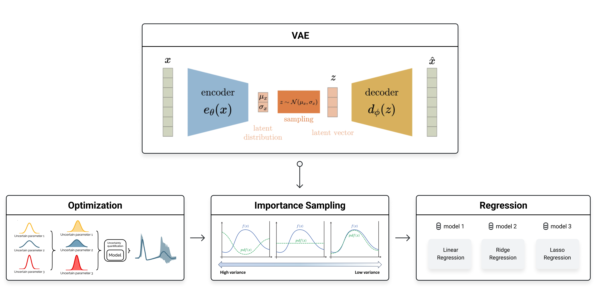

# SAIC2024
삼성 AI Challenge 리포

</br>

## Idea
1. When training and using a standard regression model for inference, I encountered performance limitations.
2. Instead of feeding the variables directly into the regression model, I thought that transforming the variables into a more suitable form could improve the model’s performance.
3. I designed a VAE to generate latent variables that would enhance the performance of the regression model.
4. I trained the encoder to optimize for better latent variables and applied the same method to the test data, generating latent variables for submission.
5. Following references, I incorporated decoder uncertainty into the optimization process to further refine the model.


</br>

## Process


</br>


## Set up the environment
```
conda env create --name ss_env --file environments.yml
conda activate ss_env
```

</br>


## How to run the project
### 1. Training
start the training process
```
python3 module/train.py
```
start tensorboard
```
tensorboard --logdir = runs
```

### 2. Inference
```
python3 module/inference.py
```
</br>

## File Sturcture
```bash
SAIC2024/
│
├── bo/                     # bayesian optimization for hyperparameter tuning
│   ├── config.py           # search space
│   ├── objective.py        # set objective    
│   └── run_bo.py           # 
│
├── data/                    
│   ├── train.csv           
│   ├── test.csv             
│   └── sample_submission.csv
│
├── models/                  
│   └── vae_model.pth         # Trained VAE model
│
├── module/                  # All Python modules for model and data processing
│   ├── dataset.py          
│   ├── vae.py               
│   ├── regression.py        
│   ├── loss.py              
│   ├── utils.py             
│   ├── visualization.py     
│   ├── train.py             
│   └── inference.py    
│
├── results/                 # Directory for saving inference results
│   ├── result_linear.csv    # Inference results from the Linear Regression
│   └── latent_train.csv
│
│
├── runs/                  
│   └── vae_regression/
│
├── sample/                  # Practice code !!!!!
│   ├── sample_diffusion
│   └── sample_vae
│
├── visualization/           # Visualization results
│   └── loss_barchart.png    # Bar chart comparing train and validation losses
│    
├── environments.yml         # Required packages and dependencies
└── README.md                
```

</br>

## Reference 
[Improving black-box optimization in VAE latent space using decoder uncertainty](https://arxiv.org/abs/2107.00096)

```
@article{notin2021improving,
  title={Improving black-box optimization in VAE latent space using decoder uncertainty},
  author={Notin, Pascal and Hern{\'a}ndez-Lobato, Jos{\'e} Miguel and Gal, Yarin},
  journal={Advances in Neural Information Processing Systems},
  volume={34},
  pages={802--814},
  year={2021}
}
```
